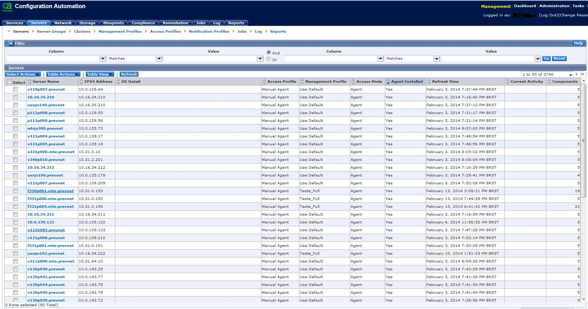
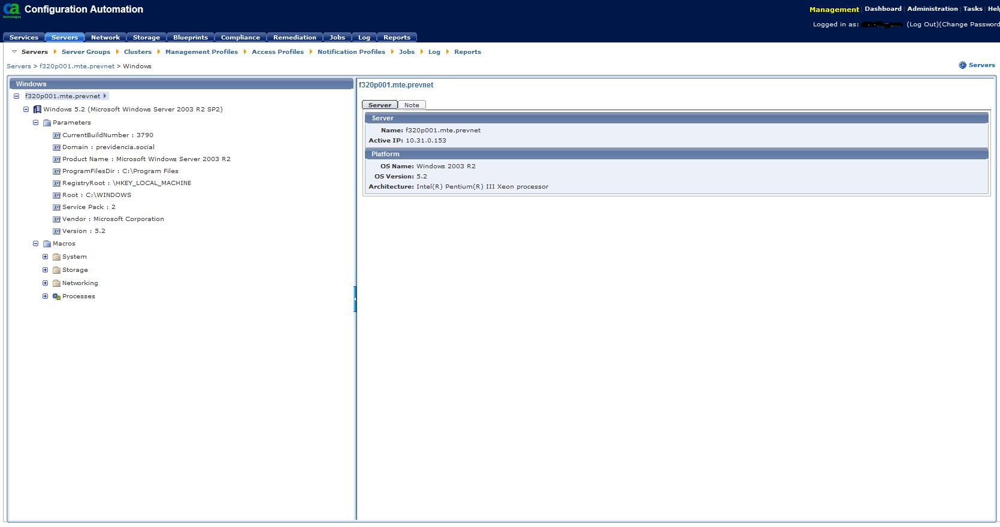
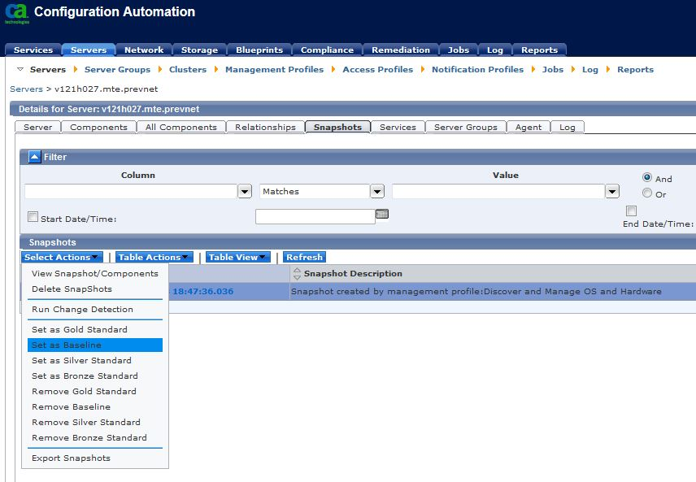

---
remark: metadados para a ser usado pelo parser de conversão para pdf ou odt
date: 28 de fevereiro de 2014
tipo_artigo: Artigo técnico de Infraestrutura de TIC
title: Gestão de configuração e Análise de conformidade utilizando a ferramenta CA Configuration Automation (CCA)
abstract: Neste artigo, mostraremos como a ferramenta *CA Configuration Automation* (CCA) dará suporte as atividades de gestão da configuração e conformidade, automatizando e provendo uma série de recursos de análise dos itens de configuração do parque tecnológico.
author:
- name: Carlos David Ribeiro Pasco
  affiliation: DEQI/DICI
responsibility: 
- name: Rogério Cyrillo
  affiliation: DEQI/DICI
diretoria: 'Diretoria de Infraestrutura de TIC - DIT'
superintendencia: 'Superintendência de Planejamento e Suporte de TIC - SUPS'
departamento: 'Departamento de Qualidade da Infraestrutura de TIC - DEQI'
tags:
- Conformidade
- Configuração
- Automação
- Infraestrutura
...

Desafios
========

Gerenciar a configuração da infraestrutura de TI de uma organização com uma grande quantidade de serviços oferecidos, muitos de alta complexidade e com uma enorme gama de tecnologias, é um enorme desafio.
Garantir que a infraestrutura entregue está de acordo com o que foi projetado — análise da conformidade, identificar e documentar mudanças realizadas em servidores e serviços e validar toda documentação associada, são atividades que estão incluídas no processo de gerência de configuração.

Benefícios
==========

- Melhorar a qualidade dos serviços;
- Tornar as informações de configuração confiáveis;
- Detectar mudanças não-autorizadas;
- Manter os serviços em conformidade com os padrões tecnológicos.

Introdução
==========
A *CA Configuration Automation* (CCA) é uma ferramenta de automação de configuração que pode ser utilizada para dar suporte as atividades de Gerência de Configuração e Análise de Conformidade.
Para que possamos ter um maior entendimento de suas funcionalidades, veremos primeiramente algumas definições para em seguida tratarmos de tópicos diretamente relacionados a ferramenta.

Gestão de Configuração, Auditoria e Conformidade
=====================================================
A Gestão de Configuração é definida como um conjunto de processos para estabelecer e manter consistência entre o desempenho e atributos físicos e funcionais do produto com seus requisitos, projeto e informações operacionais por todo seu ciclo de vida.
As atividades da Gestão de Configuração incluem identificar, documentar e verificar as características físicas e funcionais de um item; registrar a configuração de um item; e controlar mudanças em um item e sua documentação. Ela deve prover ainda uma trilha de auditoria completa das decisões e mudanças ao longo do seu ciclo de vida.
Os processos de Gestão de Configuração atuam na definição e controle dos padrões de configuração para os IC^[IC: Itens de Configuração]. Dentre os processos envolvidos se encontra a Auditoria de Configuração. Este tem por objetivo estabelecer um nível máximo de confiança na documentação de configuração utilizada como base para o controle de configuração e suporte do produto em todo seu ciclo de vida. Ela provê a estrutura e os requisitos necessários para a verificar se o esforço no desenvolvimento do produto alcançou todos os requisitos especificados nos padrões de configuração. Além disso, verifica se as mudanças ocorridas no produto foram devidamente documentadas. Os padrões de configuração servem de entrada ao processo contínuo de auditoria.
Por Análise de Conformidade entende-se como o processo que busca identificar não conformidades. Uma não conformidade é definida como um não atendimento a um requisito — em nosso caso, um requisito tecnológico, como um padrão tecnológico definido pelo Departamento de Arquitetura Técnica (DEAT) ou um requisito definido no projeto da solução.
Para que possamos realizar as atividades elencadas nos processos citados, faz-se necessário o auxílio de uma ferramenta que possa analisar os parâmetros de configuração de um produto e compará-los aos Padrões de Configuração estabelecidos. A ferramenta CCA auxilia nesta e em outras tarefas relacionadas à Gestão de Configuração e Análise de Conformidade.

A Ferramenta CCA
================
A ferramenta CCA é um software baseado em padrões que nos permite gerenciar os componentes de hardware e software distribuídos na organização através de um console web. Podemos utilizar a CCA com as seguintes finalidades:

- Descobrir os servidores existentes na organização (*discovery*);
- Encontrar quais sistemas operacionais, banco de dados e componentes de software estão instalados nestes servidores;
- Acessar dados complexos, informações e parâmetros de configuração a partir destes componentes de software;
- Determinar os relacionamentos e dependências entre os servidores na organização;
- Detectar mudanças e diferenças nas configurações de servidores e serviços;
- Tirar e guardar *snapshots* ^[*Snapshots* são cópias da configuração em um instante de tempo, como uma "fotografia" das configurações de um servidor ou serviço.] dos serviços;
- Garantir a conformidade de componentes de software e de configuração com os padrões estabelecidos pela empresa e as melhores práticas de mercado;
- Promover mudanças em uma coleção de atributos de componentes de software dentro de um serviço;
- Solucionar problemas e melhorar o tempo médio de reparo nos servidores e serviços.

Componentes da ferramenta CCA
-----------------------------

Os principais componentes da ferramenta CCA são:

- **CCA Server** — Controla todos os aspectos da operação do produto, incluindo discovery, configuração, reconciliação e análise;
- **CCA Database** — Armazena todos os dados e informações de configuração coletados pela CCA;
- **NDG** — Responsável pelas operações de discovery na rede;
- **CA EEM** — Provê serviços de autenticação de usuários e autenticação baseada em papéis;
- **CA BI** — É uma suíte de softwares de análise e relatórios oferecida em conjunto com a CCA. Provê funcionalidade de relatórios interativos;
- **Agente CCA** —Um executável leve que inspeciona e implementa operações diretamente nos servidores e em seus componentes, baseados em *blueprints*^[*Blueprints* podem ser definidos como um conjunto de atributos que definem a existência de um software. Estes abrangem detalhes como localização de arquivos de configuração, parâmetros contidos nos arquivos de configuração e entradas em registro do sistema operacional.].

Network Discovery
-----------------

Para que possamos descobrir quais servidores estão em nosso parque, e coletar informações importantes, como qual sistema operacional está sendo executado em cada um dos servidores, podemos executar um *Network Discovery*.
Um *network discovery* executa uma varredura na rede para coletar dados de servidores. Quando esta ação é realizada, o *NDG Server* entra em ação utilizando *Pingsweep* ou *TCP Connect* para varrer a rede. O NDG pode realizar a varredura também por meio de Análise de Pacotes ou *Netflow*.
O NDG pode descobrir Servidores, Hosts Virtualizadores — como um servidor VMware ESX&trade;, Dispositivos de storage SAN e clusters de servidores.
Podemos utilizar o *network discovery* para:

- Descobrir servidores e outros dispositivos em um ou mais segmentos de rede;
- Coletar e armazenar informações detalhadas de servidores como detalhes de hardware e sistema operacional, aplicações instaladas, portas abertas, detalhes de registro e serviços — estes se referem ao *Softagent Discovery*;
- Coletar e armazenar dados de hosts de máquinas virtuais, dispositivos de storage SAN e informações de cluster de servidores gerenciados;
- Identificar relacionamentos e dependências baseadas na virtualização, portas de comunicação, clusters e conexões de storage.

Application Component Discovery
-------------------------------
Após executarmos o *Network Discovery*, descobrirmos servidores e torná-los gerenciáveis, precisamos descobrir as aplicações existentes, suas configurações detalhadas e estabelecer padrões de configuração.
Um *Application Component Discovery* utiliza *blueprints* para descobrir detalhes de configuração dos servidores gerenciados pela CCA. Ele nos permite ainda descobrir informações detalhadas de configuração, possibilitando localizar arquivos de configuração, extrair seus atributos, determinar dependências e relacionamentos entre os servidores e coletar dados de aplicações para estabelecer padrões de configuração e detectar desvios de conformidade.
A ferramenta CCA possui centenas de *blueprints* de mercado e permite criar *blueprints* customizados para atender necessidades específicas.

Definindo Serviços
------------------
Os componentes de software em execução nos servidores gerenciados pelo CCA podem ser agrupados em serviços. Estes serviços são criados tipicamente para representar uma função ou produto específico, como por exemplo, todos os servidores e softwares usados no sistema CNIS^[Cadastro Nacional de Informações Sociais].
Ao serviço podemos associar perfis de gerenciamento, utilizá-lo para detectar desvios na conformidade do serviço e detectar mudanças.
A ferramenta CCA disponibiliza um painel onde podemos visualizar graficamente os componentes do serviço e as ligações entre eles.

Estabelecendo Padrões de Configuração
-------------------------------------

Os passos necessários para estabelecer uma configuração padrão e, posteriormente, identificar a ocorrência de desvios de conformidade são:

1. Construir uma instalação de servidor ou serviço padrão;
2. Descobrir este servidor ou serviço, por meio de um *network discovery*, e criar um *snapshot* dos dados;
3. O *snapshot* é criado como uma configuração padrão. Como melhor prática, designa-se o *snapshot* como *baseline*, *bronze*, *silver* ou *gold* *standard*;
4. Desvios de conformidade podem ser verificados por:  
   - Rotineiramente verificar os dados de configuração do servidor alvo definido como padrão, realizando um *refresh* na ferramenta e executando uma *Change Detection* para verificar se o servidor possui algum desvio de conformidade em relação ao seu próprio padrão de configuração;
   - Rotineiramente verificar os dados de todos os outros servidores que possuem a mesma configuração e, usando a operação de compare, checar se estes servidores possuem algum desvio de conformidade em relação ao *gold* *standard*.

Uso da ferramenta na Dataprev
-----------------------------

A ferramenta CCA está em processo de implantação e será utilizada por diversos setores, com destaque para a Divisão de Gestão de Transição de Serviços (DGTS) e a Divisão de Conformidade da Infraestrutura de TIC (DICI).
A DGTS atualmente tem trabalhado com a ferramenta para popular o novo BDGC (Banco de Dados de Gestão de Configuração), através da integração com o *CA CMDB* oferecida pela ferramenta.
A DICI por sua vez tem trabalhado na configuração da ferramenta e suas rotinas para suportar o processo de Análise de Conformidade.
*Discoveries* iniciais estão sendo realizados e jobs para execuções periódicas destes estão sendo configurados.

Conclusão
=========
A ferramenta CCA apresenta uma série de recursos que viabilizam e facilitam o processo de auditoria de configuração e análise de conformidade.
Através dos recursos de definição de padrões é possível customizar a ferramenta para utilizar os padrões de configuração estabelecidos na Dataprev. Por sua vez, definidos estes padrões podemos realizar auditorias de configuração e análise de conformidade em todo o parque.

Referências
===========

ASSOCIAÇÃO BRASILEIRA DE NORMAS TÉCNICAS. NBR ISO 10007:2005. Rio de Janeiro, ABNT, 2005.

CA TECHNOLOGIES, CA Configuration Automation r12.7 Foundations 200 Student Guide 22CCA20181. New York: CA Technologies, 2013, 283p.

DEPARTMENT OF DEFENSE – UNITED STATES OF AMERICA, Military Handbook – Configuration Management Guidance. Washington: Department of Defense, 1997, 221p.

