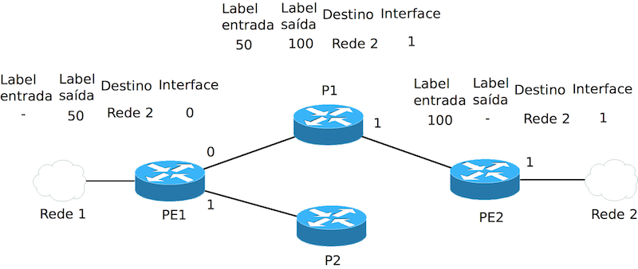
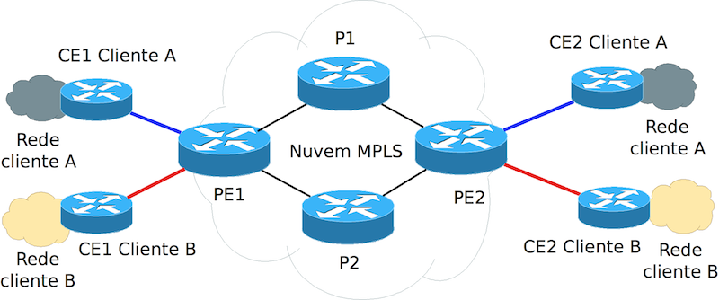
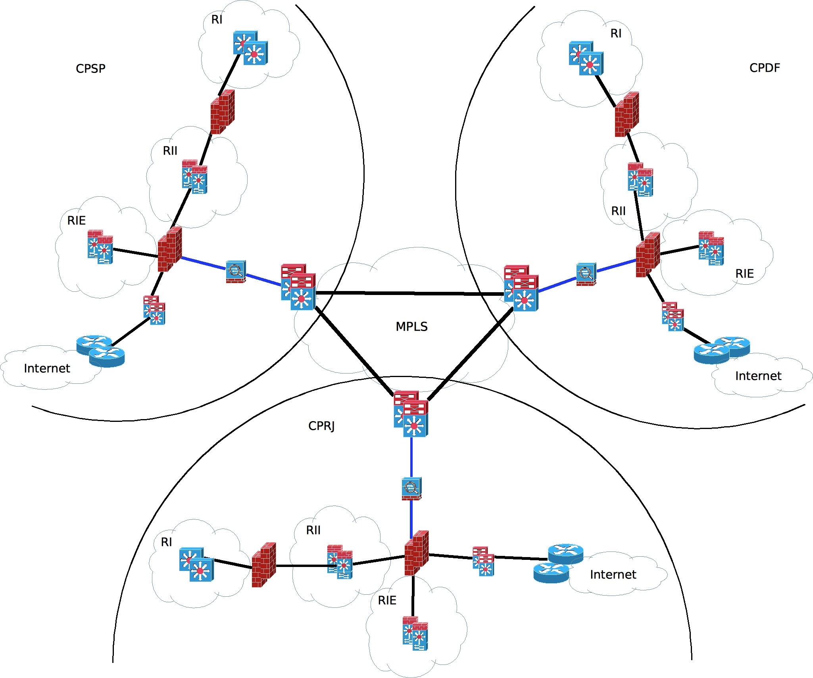

---
remark: metadados para a ser usado pelo parser de conversão para pdf ou odt
date: 28 de fevereiro de 2014
tipo_artigo: Artigo técnico de Infraestrutura de TIC
title: Implantação do MPLS no *backbone* Dataprev
abstract: Este artigo descreve de forma macro as ações necessárias para a implantação da tecnologia MPLS (*Multiprotocol Label Switching*) no *backbone* WAN da Dataprev e criação de VPNs L3 MPLS.
author:
- affiliation: DEST/DSIG
  name: Márcio Vítor Machado Barbosa
- affiliation: DEST/DSIG
  name: Pedro Rozas Moreira
responsibility:
- affiliation: DEST/DSIG
  name: Rodrigo Morgado da Silva
diretoria: 'Diretoria de Infraestrutura de TIC - DIT'
superintendencia: 'Superintendência de Planejamento e Suporte de TIC - SUPS'
departamento: 'Departamento de Suporte de TIC - DEST'
tags:
- MPLS
- Backbone
- Label
- VPN
- VRF
...

Desafios
========

Os principais desafios da implementação do MPLS no *backbone* da Dataprev serão o aprendizado da nova tecnologia, a avaliação das mudanças físicas e lógicas necessárias ao *backbone* e o planejamento desta implantação com o mínimo de impacto possível na rede.

Benefícios
==========

Abaixo, estão relacionados os possíveis benefícios da implementação do MPLS:

- Integração as regiões do MR-LAN dos CP, ou seja, regiões internas dos 3 CP interligadas sem necessidade de passar por *firewalls*;
- Segregação completa da WAN;
- Extensão L2 na WAN;
- Contingenciamento de internet entre CP;
- Contingenciamento de entidades externas entre CP.

Introdução
==========

O MPLS é uma tecnologia de encaminhamento de pacotes de alta performance desenvolvida pelo IETF que se dá através da atribuição de *labels* que determinam como e para onde esses pacotes serão encaminhados na rede. Uma vez atribuído um *label* ao pacote, elimina-se a necessidade de se examinar o cabeçalho da camada de nível 3 a cada salto subsequente na rede MPLS.

Uma breve explicação do funcionamento do MPLS
=============================================

No MPLS, é feita a atribuição de *labels* para cada rota conhecida na tabela de rotas do roteador. Uma vez que os *labels* são atribuídos é criada uma tabela de encaminhamento de *labels*, que associa o *label* à interface por onde foi aprendida a rota referenciada pelo mesmo *label*. Essas informações são trocadas entre os diferentes roteadores da rede – nós da rede MPLS, chamados de *Label Switch Router* (LSR) que podem ser do tipo P (*Provider*, quando o roteador faz apenas o encaminhamento de pacotes consultando a tabela de *labels*, sem conectividade IP direta com o cliente) ou PE (*Provider Edge*, quando existe conectividade IP com o cliente) – através de um protocolo de troca de *labels*, comumente o *Label Distribution Protocol* (LDP). É importante lembrar que para a distribuição dos *labels* é obrigatório que os LSR tenham conectividade entre si através de um protocolo IGP. No caso da Dataprev, o protocolo IGP utilizado é o OSPF.

Assim, quando um pacote entra na nuvem MPLS é inserido pelo PE um *label* entre os cabeçalhos das camadas 2 e 3. O PE faz uma consulta em sua tabela de encaminhamento para decidir para qual porta encaminhará o pacote e faz a troca do *label* de acordo com a informação que fora passada pelo próximo LSR (P ou PE) para se chegar ao destino. O processo se repete até o último salto, quando o *label* é retirado e o pacote é entregue em formato IP para o cliente. A figura 1 mostra esse processo.

A nuvem MPLS VPN e o MP-BGP
---------------------------

Uma nuvem MPLS VPN consiste em uma série de elementos componentes de uma infraestrutura de rede MPLS que são utilizados para prover serviço de VPN para diferentes clientes. A figura 2 exibe um exemplo.

Cada CE (*Customer Edge*) é interligado em L3 a um PE, onde é feita a troca de informações de roteamento (rotas IPv4) entre cliente e provedor. Esta troca usualmente se dá utilizando-se o protocolo BGP. O PE, que pode se conectar com mais de um CE, segrega cada um dos clientes por meio de VRF. Uma VRF (*Virtual Routing and Forwarding*) é definida como sendo uma tecnologia IP que permite que um roteador contenha simultaneamente múltiplas instâncias de roteamento (tabelas de roteamento) independentes e em geral sendo uma para cada cliente. Devido a independência entre as instâncias de roteamento é possivel que diferentes clientes utilizem o mesmo endereçamento IP sem que haja conflito, desde que algumas particularidades desta tecnologia, que não são escopo deste artigo, sejam obedecidas.  A VRF de um cliente é caracterizada por um parâmetro conhecido por *Route Distinguisher*, ou mais comumente abreviado para RD. Na VRF também deverão ser definidos os *route targets* (RT) que serão importados e exportados na VPN. O papel do RT será discutido posteriormente neste artigo. 

De posse das informações de roteamento IPv4 aprendidas do CE, o PE as traduz em rotas VPNv4^[A rota VPNv4 consiste na composição do RD (route distinguisher) e o prefixo IPv4. Desta forma, um prefixo IPv4 com o RD torna a rota VPNv4 única na tabela de roteamento, podendo, por exemplo, VPNs diferentes possuírem endereçamento coincidente.] que serão distribuídas pela nuvem MPLS VPN, cada uma associada ao respectivo RT exportado pela VRF do cliente. A distribuição de rotas VPNv4 dentro da nuvem MPLS se dá através do  MP-BGP (*Multiprotocol* BGP). O MP-BGP nada mais é do que a técnica de se utilizar as comunidades estendidas (*extended community*) do protocolo BGP para a distribuição de rotas VPNv4 contendo o parâmetro RT exportado pela VRF.

Dessa forma, para a implementação da nuvem MPLS VPN no *core* da rede, é importante que todos os PE da rede MPLS possuam vizinhança MP-BGP entre si. Entretanto, isto torna-se inviável para o caso de uma rede com muitos nós devido a escala e complexidade. Para eliminar este problema, são escolhidos alguns nós para fazerem o papel de refletores de rotas da rede MPLS. Os refletores de rotas, ou mais comumente conhecidos por *route reflectors*, são os elementos de rede que conhecerão todas as rotas VPNv4 da nuvem MPLS VPN. Assim, as vizinhanças MP-BGP poderão ser estabelecidas apenas entre os nós da rede MPLS e os *route reflectors*, o que simplifica muito a operação da rede.

Uma vez que as rotas VPNv4 são distribuídas pela nuvem MPLS VPN, é necessário que os PE sejam capazes de determinar em quais VRF essas rotas serão inseridas. É neste momento que o *route target* citado anteriormente faz-se necessário. Conforme dito anteriormente, as VRF exportam e importam um (ou mais) *route targets*. Cada rota VPNv4 terá associada como *extended community* o RT exportado pela sua VRF. Logo, os PE incluirão apenas as rotas VPNv4 nas VRF que estiverem importando o RT discriminado na *extended community* dessas rotas.
	
Ativando o MPLS no *backbone*
-----------------------------

A topologia mostrada na figura 3 apresenta uma visão do *backbone* com MPLS implantado, onde dentro da nuvem MPLS haverá tráfego por encaminhamento de pacotes e por fora da nuvem, tráfego puramente IP. A lógica básica de funcionamento consiste nas seguintes premissas:

- Rodar um protocolo IGP no interior da nuvem MPLS para a troca do endereçamento das interfaces *loopbacks* exclusivamente. Para facilitar a solução, o protocolo OSPF que já estava ativo na rede foi escolhido para ser o protocolo IGP;

- Habilitar um protocolo para a distribuição de *labels* de encaminhamento no interior da nuvem MPLS. Neste caso, o protocolo a ser utilizado será o LDP (*Label Distribution Protocol*). Este protocolo será responsável por mapear as rotas do IGP (OSPF) em *labels* e distribui-las pelos roteadores;

- Habilitar o protocolo MP-BGP entre os roteadores envolvidos de forma com que as rotas VPNv4 e *labels* de VPN (RT) sejam transportados entre os PE. Neste contexto, todos os roteadores da nuvem MPLS no *backbone* Dataprev são do tipo PE. Os 6500 atuarão como PE do *datacenter* e os 7200 atuarão como PE de acesso. As vizinhanças MP-BGP entre os 6500 de *backbone* serão estabelecidas pelas interfaces *loopbacks* desses roteadores.

Configurando as VPNs dos clientes
---------------------------------

Para cada cliente da nuvem MPLS, deverá ser configurada uma VRF correspondente em cada um dos PE que participarão da VPN do cliente. Na VRF, os seguintes parâmetros deverão ser determinados:

- Nome da VRF, que identificará a que cliente se refere;

- *Route distinguisher* (RD), que determina as diferentes tabelas de roteamento para cada cliente, configurando as VRF. É um parâmetro único para cada cliente em um nó da rede e deverá ser diferente em cada nó da rede para um mesmo cliente;

- *Route Target*, que é utilizado para se criar a topologia de uma VPN. É através deste mecanismo que são distribuídas as informações de roteamento dentro da VPN de um cliente na nuvem MPLS. Através da importação e exportação deste parâmetro no MP-BGP, o roteador PE saberá em qual VRF cada rota VPNv4 aprendida de seus vizinhos BGP deverá ser incluída.

Uma vez configurada a VRF no roteador, esta deverá ser associada a interface L3 do PE ao qual o CE se conecta. 

Conclusão
=========

Em virtude da grande flexibilidade do MPLS, que permite ofertar uma série de serviços, conclui-se que a sua implementação no *backbone* da Dataprev proporcionará uma série de benefícios, os quais se destacam em um primeiro momento a integração do modelo do MR-LAN nos três CP (em especial, devido à maior facilidade, inciando pela integração das regiões internas, que permitiria a comunicação entre essas regiões sem passar pelos *firewalls* externos, desonerando estes equipamentos) e o contingenciamento das saídas de internet nos três CP (o que permite que, mesmo com uma eventual queda de todos os circuitos de internet de um CP, o tráfego seria contingenciado para outro CP de forma transparente).

Referências
===========
	
CISCO. Cisco IOS Switching Services Configuration Guide - Multiprotocol Label Switching Overview, xxxx. Disponível em: <http://www.cisco.com/c/en/us/td/docs/ios/12_2/switch/configuration/guide/fswtch_c/xcftagov.pdf>. Acesso em: 18 mar. 2014

Rosen, E.; Viswanathan, A.; Callon R. RFC 3031: Multiprotocol Label Switching Architecture, IETF, 2001

CISCO. Cisco Active Network Abstraction Reference Guide, 3.7, 2010. Disponível em: <http://www.cisco.com/c/en/us/td/docs/ios/12_2/switch/configuration/guide/fswtch_c/xcftagov.pdf>. Acesso em: 20 mar. 2014

KUROSE, J. F.; ROSS, K. W. Redes de Computadores e a Internet: uma abordagem top-down. Tradução de Arlete Simille Marques; revisão técnica Wagner Luiz Zucchi. 3ª ed., São Paulo: Pearson Addison Wesley, 2006.

CISCO. MPLS: Layer 3 VPNs Configuration Guide, Cisco IOS Release 15M&T, xxxx. Disponível em: <http://www.cisco.com/c/en/us/td/docs/ios-xml/ios/mp_l3_vpns/configuration/15-mt/mp-l3-vpns-15-mt-book/mp-bgp-mpls-vpn.pdf>.
 Acesso em: 24 mar. 2014

CISCO. Configuring a Basic MPLS VPN, 2007. Disponível em: <http://www.cisco.com/c/en/us/support/docs/multiprotocol-label-switching-mpls/mpls/13733-mpls-vpn-basic.pdf>. Acesso em: 20 mar. 2014

Sangli, S.; Tappan, D.; Rekhter, Y. Callon R. RFC 4360: BGP Extended Communities Attribute, IETF, 2006
