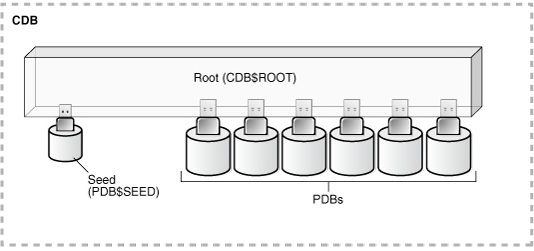
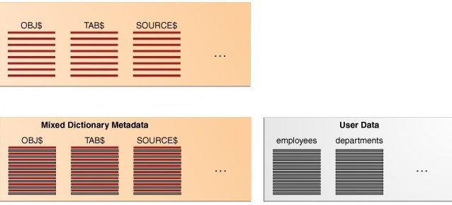
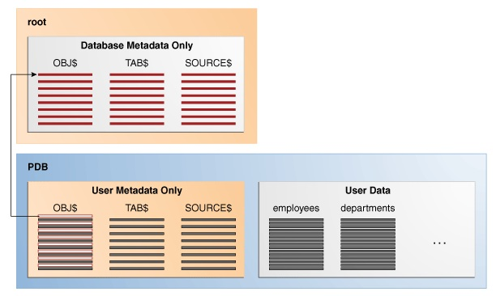
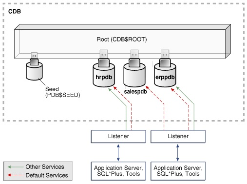
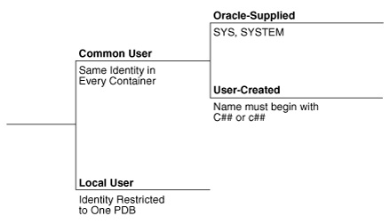
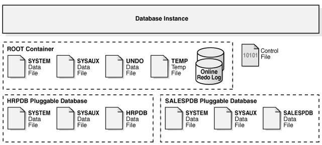

Introdução
==========

Muitas Empresas possuem em seus sites, centenas ou milhares de bancos de dados espalhados por diversos servidores e plataformas, ocasionando aumento na complexidade de gerenciamento e desperdício de recursos de hardware. Os custos associados impulsionam iniciativas para consolidação destes ambientes.

Algumas motivações para a consolidação são elencadas abaixo:

  - Tempo gasto para administração e gerenciamento destes ambientes;

  - A complexidade que os ambientes de banco de dados adquiriram;

  - O mal aproveitamento de recursos de hardware e

  - O aumento do uso licenças de SGBD.

  
A nova feature Oracle Multitenant possibilita a consolidação dos ambientes de banco de dados de forma transparente, sem requerer modificações ou causar impacto nos níveis de desempenho das aplicações.

Este artigo tem como objetivo apresentar arquitetura Oracle Multitenant.

Desafios
========

Alguns desafios são apresentados na adoção do Oracle Multitenant:

  - Mapear o ambiente atual, identificando as necessidades de consolidação e os benefícios a serem alcançados;

  - Planejar o novo ambiente a ser consolidado e

  - Identificar os recursos (software e hardware) requeridos para o ambiente planejado.

  
Benefícios e/ou recomendações
=============================

A adoção da arquitetura Oracle Multitenant  traz os seguintes benefícios :

  - Alta densidade de consolidação de banco de dados por servidor – Diversos pluggable databases (PDBs) contidos em um container database (CDB), compartilham sua memória e processos background. Haverá um melhor aproveitamento de recursos de hardware e aumento da escalabilidade.

  - Provisionamento e clonagem de banco de dados de forma simplificada – um pluggable database (PDB) poderá ser desconectado (unplugged) de um container database (CDB) e ser conectado (plugged) em outro container database (CDB).

  - Facilidade no gerenciamento e monitoração do ambiente consolidado – apenas um único banco de dados físico (um set de arquivos e uma instance) será gerenciado e monitorado. Estratégias de backup e recuperação também ficarão simplificadas.

  - Separação de dados e código – apesar da consolidação em um único banco de dados físico, é possível recuperar point-in-time ou executar  flashback somente um pluggable database (PDB), sem afetar os outros pluggable databases (PDBs) que estão compartilhando o mesmo container database (CDB).

  - Facilidade na análise de performance – é muito mais simples coletar métricas para um único banco de dados. Realizar ajustes em uma SGA  é muito mais simples e rápido do que em várias SGAs.

  - Facilidade para aplicação de patches e execução de upgrades – é muito mais simples aplicar patches ou executar upgrades em um único banco de dados.

  - Suporte para Oracle Database Resource Manager – o Resource Manager gerencia os recursos entre os pluggable databases (PDBs) dentro do container database (CDB), e os recursos dentro de um pluggable database (PDB). 

  
Arquitetura Multitenant
=======================

A arquitetura Multitenant habilita um banco de dados a funcionar como um multitenant container database (CDB). Em um container database (CDB), existem um ou mais pluggable databases (PDBs). 

Componentes de um CDB
---------------------

Um CDB possui os seguintes componentes:

  - Root -  é o container que armazena metadados do Oracle necessários para gerenciar PDBs e usuários comuns. Cada CDB possui somente um container Root e todos PDBs pertencem ao Root. O container Root tem como nome CDB$ROOT.
  
  - Seed - é um container templete para a criação de novos PDBs. Um CDB tem somente um container Seed, que tem como nome PDB$SEED.

  - PDBs - um container PDB é um conjunto de esquemas, objetos e estruturas relacionados que aparecem logicamente para uma aplicação como um banco de dados separado. PDBs isolam dados e código de tal forma, que estes são vistos pelas aplicações e usuários como ambientes tradicionais de banco de dados (non-CDBs).

  
Cada container possui um único ID e nome dentro do CDB. A figura 1 mostra um CBD com vários PDBs.

	

*Figura 1 - CDB com PDBs*

Arquitetura do Dicionário de Dados em um CDB
--------------------------------------------

Em uma arquitetura non-CDB, o dicionário de dados será comum, ou seja, este conterá linhas que descrevem entidades do Oracle e linhas que descrevem entidades criadas pelos usuários. A figura 2 mostra primeiro o dicionário de dados com metadados do Oracle logo após a criação do banco de dados. Em seguida, é mostrado o dicionário de dados com metadados do Oracle e metadados de tabelas de usuários.

	

*Figura 2 - Dicionário de Dados Comum*

Já em uma arquitetura CBD, o dicionário de dados é dividido entre o Root e os PDBs. Esta divisão, permite que o Oracle gerencie cada PDB e o Root de forma separada. A figura 3 mostra este cenário.

*Figura 3 - Dicionários de Dados Separados*

Existem ponteiros no dicionário de dados do PDB para o dicionário de dados do Root. Em cada PDB a tabela OBJ$ tem um ponteiro para a tabela OBJ$ no Root, que por conseguinte armazena sua definição.

Os metadados de objetos do dicionário de dados do Oracle é armazenado no Root e os metadados dos objetos dos PDBs são armazenados em seu próprio dicionário de dados.

O dicionário de dados onde estão os metadados do CDB está armazenado na tablespace system. O dicionário de dados de cada PDB está armazenado em tablespace associada ao PDB.

Current Container
-----------------

Um current container é aquele em que a sessão está sendo executada. Um current container pode ser o Root ou um PDB.

Cada sessão tem exatamente um current container em um ponto no tempo. Uma vez que o dicionário de dados é separado por container, o Oracle utiliza o dicionário de dados do current container para resolução de nomes e autorização de privilégios.

Services em um CDB
------------------

Clientes devem conectar-se aos PDBs através de serviços. Uma conexão utiliza um nome de serviço e inicia uma nova sessão em um PDB. Uma sessão possui um current container exclusivo. A figura 4 mostra dois clientes que se conectam a PDBs usando dois listeners diferentes.

*Figura 4 - Services em um CBD*

Common e Local Users em um CDB
------------------------------

Um usuário comum é aquele que possui a mesma identidade no container Root e nos containers  PDBs. Cada usuário comum pode se conectar e executar operações dentro do Root e do PDB em que tiver privilégios. Exemplo de usuários comuns são os SYS e SYSTEM.

Um usuário local é aquele que pode operar em somente um único PDB e sua identidade é restrita a este PDB.

A figura 5 mostra as possibilidades de usuários em um CDB.

*Figura 5 – Usuários em um CBD*

Common e Local Roles em um CDB
------------------------------

Uma role comum é aquela que existe no container Root e em todos containers PDBs. Uma role comum ou é uma role fornecida pelo Oracle ou criada pelo usuário. Todas as roles fornecidas pelo Oracle são comuns. Exemplo de roles comuns são as DBA e PUBLIC.

Uma role local existe somente em um PDB e pode ter privilégios e roles atribuídos a si, somente dentro do seu contexto que é o container.

Privilegios e Roles atribuídos em um CDB
----------------------------------------

Em um CDB, roles e privilégios podem ser atribuídos de forma comum ou localmente. Um privilégio ou role atribuído localmente tem atuação somente no container em que foi atribuído. Já um privilégio ou role atribuído de forma comum, tem atuação em todos containers.

Arquitetura Física de um CDB
============================

Uma única instance, ou no caso do Oracle RAC, várias instances são compartilhadas pelos PDBs. Também são compartilhados os processos background. 

Cada PDB possui seu próprio conjunto de tablespaces, incluindo sua própria tablespace system e sysaux. 

Um CDB possui os seguintes arquivos físicos:

- Um controlfile;

- Um ou mais conjunto de tempfiles;

- Um conjunto de undo datafiles;

- Um conjunto de system e sysaux datafiles para cada container e

- Zero ou mais conjuntos de datafiles definidos pelos usuários.

A figura 6 mostra os aspectos de armazenamento da arquitetura física em um CDB.

*Figura 6 – Arquitetura física em um CDB*

Conclusão
=========

A option Oracle Multitenant oferece novos recursos que possibilitam a consolidação de banco de dados, e promove diversos benefícios, dentre eles, um melhor aproveitamento de recursos de hardware, melhoria no gerenciamento e administração de todo ambiente, a economia em custos em TI e assim por diante. 

Cada Empresa deve avaliar seu ambiente de banco de dados e identificar suas necessidades de consolidação. Em caso positivo, um planejamento prévio deve ser elaborado, para que o novo ambiente consolidado através do Oracle Multitenant seja devidamente implantado.

Referências
===========
---
references:
- id: Oracle2014A
  title: Oracle® Database Concepts 12c Release 1 (12.1)
  author:
  - family: Ashdown
    given: Lance
  - family: Kyte
    given: Tom
  URL: 'http://docs.oracle.com/database/121/CNCPT/toc.htm'
  accessed:
    day: 15
    month: Agosto
    year: 2014
  publisher: Oracle
  type: book
  issued:
    year: 2014
    month: 08
	
- id: Oracle2014B
  title: Oracle® Database Administrator's Guide 12c Release 1 (12.1)
  author:
  - family: Urbano
    given: Randy
  URL: 'http://docs.oracle.com/database/121/ADMIN/toc.htm'
  accessed:
    day: 15
    month: Agosto
    year: 2014
  publisher: Oracle
  type: book
  issued:
    year: 2014	
    month: 07

- id: Oracle2014C
  title: Oracle® Database New Features Guide 12c Release 1 (12.1)
  URL: 'http://docs.oracle.com/database/121/NEWFT/toc.htm'
  accessed:
    day: 15
    month: Agosto
    year: 2014
  publisher: Oracle
  type: webpage
  issued:
    year: 2014	
	
- id: Oracle2014D
  title: Oracle Multitenant - Oracle White Paper June 2013
  author: Oracle
  URL: 'http://www.oracle.com/technetwork/database/multitenant/overview/multitenant-wp-12c-2078248.pdf'
  accessed:
    day: 15
    month: Agosto
    year: 2014
  publisher: Oracle
  type: article
  issued:
    year: 2013		
---
