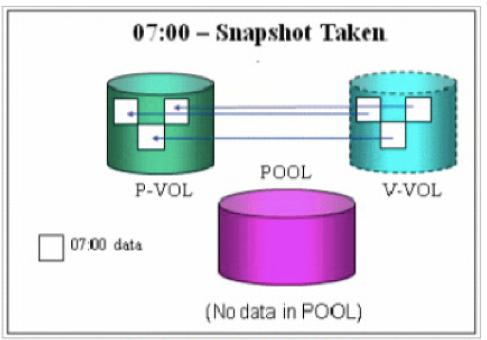
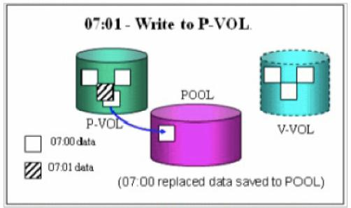
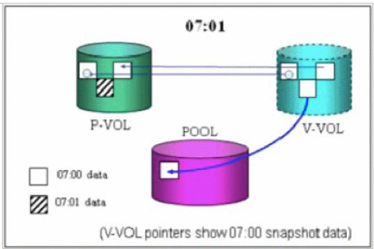

---
date: 28 de fevereiro de 2014
tipo_artigo: Artigo técnico de Infraestrutura de TIC
title: Funcionamento do Snapshot nos storages VSP
abstract: Este documento fornece informações e recomendações sobre operações de *Copy-on-Write* (*snapshot*) nos sistemas de armazenamento da *Hitachi Virtual Storage Platform* (HVSP).
author:
- affiliation: DEST/DSPD
  name: Erika Joana Corrêa Brandão
responsibility:
- affiliation: DEST/DSPD
  name: Eduardo Vale de Carvalho
diretoria: 'Diretoria de Infraestrutura de TIC - DIT'
superintendencia: 'Superintendência de Planejamento e Suporte de TIC - SUPS'
departamento: 'Departamento de Suporte de TIC - DEST'
tags:
- Storage
- Snapshot
- Hitachi
- Virtualização
...

Introdução
==========
A Dataprev adquiriu recentemente a atualização tecnológica dos seis storages Hitachi USP-V. Cada storage VSP possui uma capacidade líquida de 1PB para armazenamento.

Os storages USP-V estão distribuídos da seguinte forma:
 
- CPRJ -> 1 Storage sata com 257TB e 1 storage FC com 223TB, totalizando 480TB
- CPSP -> 1 Storage sata com 175TB e 1 storage FC com 223TB, totalizando 398TB
- CPDF -> 1 Storage sata com 176TB e 1 storage FC com 223TB, totalizando 399TB

Neste arquivo vamos descrever uma das principais features adquiridas com a atualização tecnológica dos storages Hitachi: Copy-on-Write (CoW). 

Desafios
========
O Copy-on-Write ou Snapshot possibilita a replicação de dados point-in-time sem interferir nos níveis de desempenho do storage. 

Benefícios
==========
Com o CoW, podemos fazer um snapshot dos dados contidos em um determinado volume do storage antes de alterá-lo.

Os snapshots armazenam apenas os blocos de dados alterados no pool de armazenamento Copy-on-Write, dessa forma, a capacidade de armazenamento necessária para cada cópia point-in-time é substancialmente menor do que o volume de origem. Esse recursos ocupa menos espaço em disco que um clone dos dados, por exemplo.

O processo de snapshot
======================
O volume primário (P-VOL) que contem os dados originais é selecionado e pode continuar sendo utilizado normalmente durante o snapshot. É criado então um volume virtual (V-VOL) que aponta para os dados existentes no P-VOL, exatamente como ele se encontra no momento do snapshot. Além do V-VOL, é criado também um pool de dados para armazenar os blocos alterados após a realização do snapshot.

Quando o P-VOL é alterado o snapshot copia os blocos que foram alterados para o um pool de dados, que ainda não contem dados, mantendo o estado dos dados do snapshot inalterados. Com isso, quanto mais antigo é o snapshot, maior será a área ocupada pelo mesmo. 

Quando o snapshot é removido, o pool de dados do snapshot é deletado. 

Podem ser criados até 64 snapshots de um determinado P-VOL.

Como o V-VOL mantém os ponteiros para o dados contidos no P-VOL e copia apenas os blocos alterados, essa feature não preserva os dados caso a área original (P-VOL) seja destruída por um problema físico, já que a maior parte dos dados permanecem no P-VOL. Nesse caso apenas a replicação dos dados iria manter uma cópia integra dos dados originais. Porém, em caso de deleção ou alteração acidental dos dados originais, a réplica iria ser alterada da mesma forma que os dados originais.

Funcionamento interno do snapshot
---------------------------------
Snapshot realizado às 7 horas  

Alguns blocos do P-VOL foram alterados às 07:01  

Como o V-VOL mantém os dados originais que foram alterados?  

Após a realização do snapshot o V-VOL mantém ponteiros para os dados armazenados no P-VOL e para os blocos que foram alterados e encontram-se armazenados no pool de dados.

Para a realização do snapshot são necessários os seguintes componentes no storage:

- Licença para Copy-on-Write
- Licença para ShadowImage
- Um par de volumes (P-VOL e V-VOL)
- Um pool de dados
- Um consistency group
- Storage Navigator

Consistency groups
------------------
Os bancos de dados e alguns filesystems ficam armazenados em vários volumes (discos de storage) simultaneamente. A operação de snapshot pode ser realizada em múltiplos pares de volumes na mesma hora quando eles são agrupados em um consistency group. O consistency group é criado na definição do snapshot para manter a integridade dos dados que utilizam mais de um volume.

Storage Navigator
-----------------
Ferramenta que acompanha os storages Hitachi e vem instalada na console interna do storage. Essa ferramenta se comunica diretamente com o Service Processor (SVP) do storage.

Recomendações
-------------
Atualmente os storages armazenam bancos de dados, servidores virtuais e filesystems com arquivos da produção. Para minimizar possíveis problemas, o Snapshot pode ser utilizado, por exemplo, antes da aplicação de patches ou pequenas alterações de configuração nos bancos de dados. Para isso, basta:

- Parar o banco de dados;
- Fazer um Snapshot;
- Liberar o banco para a atualização necessária.

Em caso de problemas após a atualização, podemos voltar o Snapshot com o estado anterior do banco de dados.

Conclusão
=========
A utilização do CoW facilitará as alterações dos dados contidos nos storages em várias situações, como:

- aplicação de patches;
- realização de testes;
- proteção de dados (backup);
- operações que exijam uma recuperação rápida do estado anterior dos dados.

Referências
===========
- HITACHI. Hitachi Virtual Storage Platform - Hitachi Copy-on-Write Snapshot User Guide, Hitachi Data Systems, 2010. Disponível em: <http://maben.homeip.net/static/computers/backup/storage/HDS/VSP/docs/Copy-on-WriteSnapshotUserGuide.pdf>. Acesso em: 21 jan. 2014.

